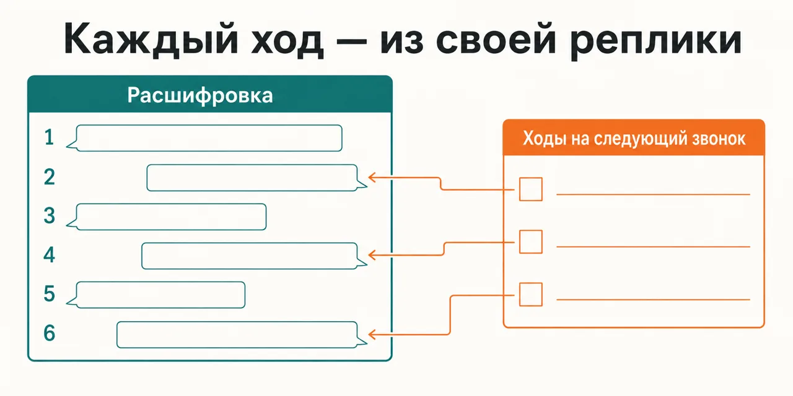

English · [Русский](README.md)

# The call ended, and a day later you remember the mood, not the place where it went off the rails

The review runs on a transcript with numbered turns: every finding is pinned to a turn number, and a
reference to a turn that is not in the transcript is thrown out by a mechanical check before the
council ever assembles a verdict.

```
claude plugin marketplace add https://github.com/beCyborg/jadlis-start.git
claude plugin install advisor-sales@jadlis
```

No keys and no outside subscriptions are needed; there is one setting — `MEMORY_DIR`, the folder the
verdicts, the run log and the deal profile go into: the council writes nothing outside it.



In words: on the left, a transcript with numbered turns; on the right, a short list of moves for the
next call, each with an arrow back to the turn it grew out of.

This is my workbench published as it is, not a product: whatever I stopped using, I removed.

## Before → after

| By hand | With an AI chat | With this plugin |
|---|---|---|
| **What is left of the call.** A general impression is left; the place where the conversation went off the rails cannot be reconstructed from memory. | It reviews your retelling — and therefore the mood you retold it in. | A finding is void without a turn number, and the number is checked against the transcript file by a string search before the verdict is synthesised. |
| **How many fixes come out of a review.** A checklist produces a long list of corrections, and not one of them reaches the next call. | The list comes out exactly as long as the question pulled it. | No more than three moves come out, each pinned to a moment of the previous call; the rest stays in the timeline instead of in your tasks. |
| **When to let the deal go.** Nobody names the sign, so the deal gets pushed until pushing turns awkward. | It answers "how do I close this", because that is what was asked. | A move is not released without a disqualification criterion: next to the diagnosis stands the sign of "there is no deal" and the date it gets checked against. |
| **Whose book you measure by.** You measure by the book you read last — and it always agrees. | It blends the schools into one smooth piece of advice, and whose argument it is cannot be seen. | Sixteen advisors each read their own book separately; agreement inside one school carries no weight, the bonus is only for agreement across clusters. |
| **Whose playbook you apply.** Advice from an enterprise deal is driven onto a micro-ticket with a single decision-maker — and stretches the cycle. | It never asks about the size of the ticket or the number of people in the room. | The deal profile is collected up front: an advisor whose context does not match is excluded by name with a reason, the rest get their weight adjusted by a multiplier — and both are printed in the verdict header. |

## How it works


Going in — a transcript with the speakers marked (or a description of a stalled deal) and the
profile: kind of sale, size of the ticket, who decides, what you are playing against.
Inside — the layers read the input separately, a mechanical check throws out references to turns
that do not exist, a curator picks the disputed claims, and three skeptics go at each of them.
Coming out — a verdict as a file in your folder: a timeline with turn numbers, the moves, and the
sign that tells you the deal is over.

In words: transcript and deal profile → layers read separately → turn-number check and skeptics on
every disputed claim → a verdict file with moves and disqualification criteria.

Pick the mode with a flag: `--call` reviews a call transcript, `--deal` diagnoses a stalled deal
from your description, `--verdict` grades a finished artefact (a discovery script, a pitch, a cold
message, a proposal, a post-demo email), `--write` writes the text — brief, three drafts in
different frames, critique by advisors matched to the kind of text, then the final synthesis. With
no flag the mode is read off the request, and an ambiguous case is put back to you as a question.

What the skeptics take down does not reach the moves: a refuted claim drops out, a contested one
goes into the "against" section with a mark. The full roster never runs in any mode — a subset is
picked for the kind of task, because irrelevant books produce plausible noise. The roster is
sixteen advisors across twenty-one books: some layers carry two books at once, and then each book
gets its own suffix in the tag so that two sources of one advisor are not counted as two votes.

## Installing and the first run

**a) Text to paste to an agent.** Copy the whole thing into a Claude Code chat:

```
You are the installer. Install the plugin advisor-sales from the jadlis marketplace on this Mac.
Run exactly these commands, verbatim, shortening nothing:
1. claude plugin marketplace add https://github.com/beCyborg/jadlis-start.git
2. claude plugin install advisor-sales@jadlis --config MEMORY_DIR=~/advisors-memory
3. claude plugin list - show me the line about advisor-sales and its version.
MEMORY_DIR is a folder on my disk where the council writes verdicts, the log and the deal profile.
I pick the path: ask me before the second command and put my answer in place of ~/advisors-memory.
Before each command show it to me in full and wait for "yes". If I say "no", do not run it,
tell me what you skipped, and move on.
If a command returns an error, stop, show me the output, and do not move to the next one.
```

**b) Commands by hand.**

```
claude plugin marketplace add https://github.com/beCyborg/jadlis-start.git
claude plugin install advisor-sales@jadlis
claude plugin list
```

The first command installs nothing — it adds the marketplace. Only the second one installs, and one
line removes it: `claude plugin uninstall advisor-sales@jadlis --keep-data`.

The memory folder can be passed straight into the install — `claude plugin install
advisor-sales@jadlis --config MEMORY_DIR=~/advisors-memory`. The default is `~/advisors-memory`; the
folder skeleton (logs, profiles, swipe file) is unrolled on the first run and never touches files
that already exist. To change the path later, go through `/plugin` → advisor-sales → settings, or
reinstall with `--config`. If the setting did not resolve, the very first run stops and says so: the
council writes nothing into your project folder.

**c) The short command.** Open Claude Code in the folder you work in and type:

```
/advisor-sales --call <path to the call transcript>
```

The other three modes — `--deal`, `--verdict`, `--write` — are the same flags on the same command;
there are no sub-skills per mode. If it is not found, check the name with `claude plugin list`.

## Limits, cost, updating

**What it does not do.** It does not find customers and does not build a funnel — that is
`advisor-influence`. It does not write landing pages, newsletters or sales posts — that is
`advisor-copywriting`. It does not price your product — that is `advisor-product`. Webinars and
selling from a stage it does not take at all: that track is postponed, and the council says so out
loud. It does not mark up the speakers in your transcript for you: if the turns are unmarked and
cannot be recovered, the mode degrades out loud into a review of a summary, because there is nothing
left to pin findings to. It does not keep transcripts silently: a copy of a real call goes into the
memory folder only on your confirmation and only after you have scrubbed the names and companies —
otherwise the run folder is deleted whole. And it does not run the deal for you: you make the move,
and the outcome stays yours.

Tags of the form `[PREFIX:CODE]` point at a block of a digest inside the plugin, not at a page of a
book: they are the handle by which a recommendation can be opened and argued with, not a
bibliographic reference. The limits on using the digests are in `NOTICE.md`.

**What you need.** No keys, no outside subscriptions and no external CLIs: everything is computed
inside Claude Code, out of your quota. You need the memory folder (`MEMORY_DIR`) and, for `--call`, a
call transcript with the speakers marked — the plugin does not produce that. For `--write` the brief
asks for the customer's verbatim phrases and real proof: cases and figures are not invented for you.

[уточнить] - the repository pins no minimum Claude Code version; the skill and its worker agent are
declared on Opus with high effort, and behaviour on a plan without Opus has not been checked.

**How tokens get spent.** A heavy run means dozens of subagents out of your quota: the layers read
the input in parallel, then the curator, then skeptics on every disputed claim, then the validator.
`--call` and `--verdict` cost the most, `--deal` and `--write` less; the council shows you the
estimate before it starts. It does not degrade partially: an exhausted session window takes the
whole fan-out down — the lenses come back refusing, there is no verdict, so councils are not planned
back to back inside one window. One question, one wording, one objection — no council is convened at
all: a single lens answers.

**Verified where I work:** my Mac, my subscription, my tasks. Where else this works — [уточнить].

**Terms of use.** There is no license: all rights reserved by the author. You may read it and use it
personally. Commercial use, republishing and bundling it into your own products — by arrangement
with me.

**Updating.** With a third-party marketplace, auto-update is off on your side: until you run the
first command you keep the version you installed.

```
claude plugin marketplace update jadlis
claude plugin update advisor-sales@jadlis
claude plugin list
```

Reinstall, if something ended up crooked:

```
claude plugin uninstall advisor-sales@jadlis --keep-data && claude plugin install advisor-sales@jadlis
```

This repository is assembled by a generator from a private source: an edit made here does not
survive a release — CI checks the contents against the hash in `SHARED_FROM.txt`. Open the issue
here; it gets fixed in the source.
